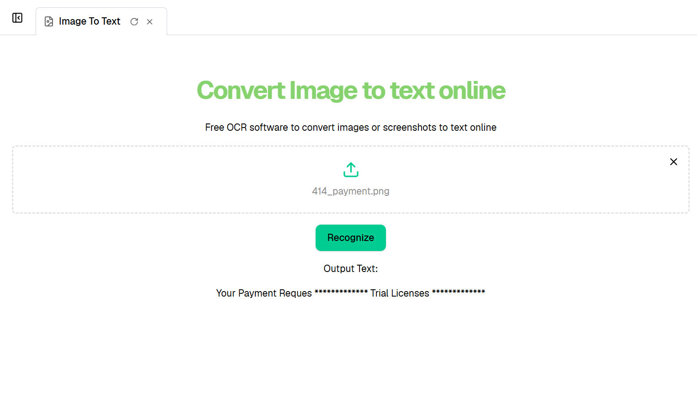

# Ivy.Aspose.OCR.Examples 

Web application created using [Ivy](https://github.com/Ivy-Interactive/Ivy-Framework). 

Ivy is a web framework for building interactive web applications using C# and .NET.

## How it works

This web application demonstrates OCR (Optical Character Recognition) using Ivy and Aspose.OCR. Users can upload an image (JPEG, up to 1MB), and the app extracts text from the image using an OCR service. The workflow is:

1. Upload an image using the provided form.
2. The app validates the file size and type.
3. On clicking "Recognize", the image is processed and text is extracted.
4. The recognized text is displayed on the page.

## Run

```
dotnet watch
```

## Output Screenshot


