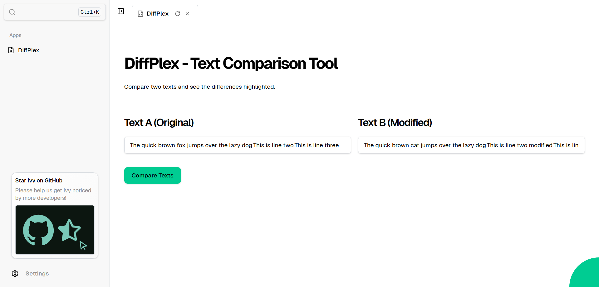

# DiffPlex – Text Comparison Tool

An Ivy example demonstrating text comparison and diff visualization using the DiffPlex library.

## What It Does

This example shows how to compare two text blocks and highlight their differences. It displays:
- **Inserted lines** (additions in Text B)
- **Deleted lines** (removals from Text A)
- **Modified lines** (changes between versions)
- **Unchanged lines** (matching content)

## Screenshot



## How to Run

1. **Restore dependencies:**
   ```bash
   dotnet restore
   ```

2. **Run the application:**
   ```bash
   dotnet run
   ```

3. **Open in browser:**
   - Ivy will automatically launch Chrome
   - Select the "DiffPlex" app from the sidebar

4. **Use the tool:**
   - Edit the text in either text box
   - Click "Compare Texts" to see the differences
   - View color-coded results with a legend

## Libraries Used

- **Ivy**: 1.0.115.0 - Declarative UI framework for C#
- **DiffPlex**: 1.9.0 - Text differencing library

## Features

- Side-by-side text input for original and modified text
- Color-coded diff output:
  - 🟢 Green: Inserted lines
  - 🔴 Red: Deleted lines
  - 🟡 Yellow: Modified lines
- Visual legend showing diff symbols (+, -, ~)
- Clean, card-based result display

## Notes

This is a minimal implementation focusing on inline diff visualization. For more advanced features, explore DiffPlex's other builders like SideBySideDiffBuilder.