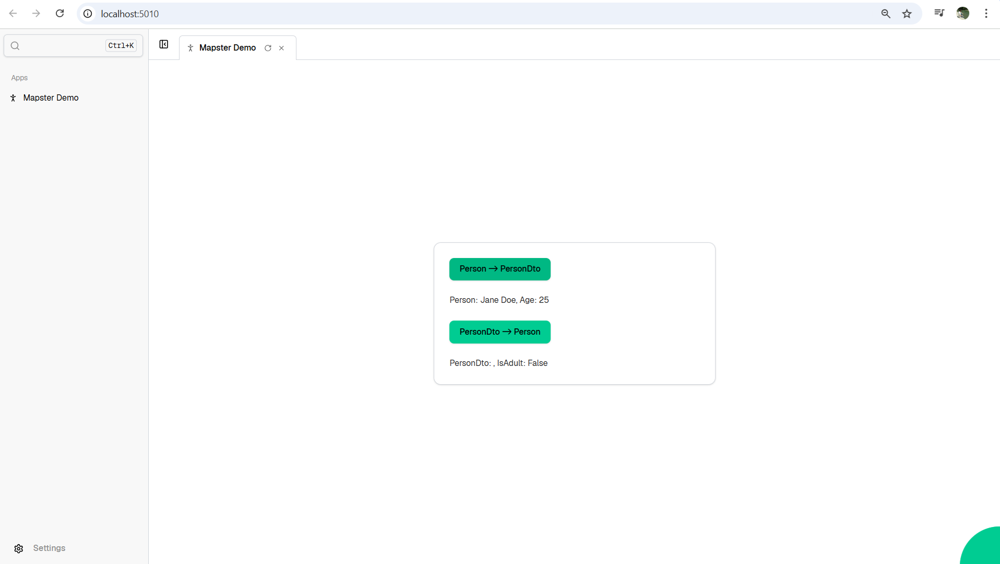

# Mapster Demo App

This is a **Mapster demonstration app** built using the **Ivy Framework 1.0.115**.  
It showcases **mapping** between `Person` and `PersonDto`.

## Overview

The app includes:

- A button to map **Person → PersonDto**
- A button to map **PersonDto → Person**
- Display of current `Person` and `PersonDto` objects
- Using Ivy `ViewBase`

## Screenshot



## How It Works

- `Person` and `PersonDto` objects are stored using `UseState<T>()`.
- Clicking **Person → PersonDto** will create a sample `Person` (if null) and map it to `PersonDto` using **Mapster**.
- Clicking **PersonDto → Person** will create a sample `PersonDto` (if null) and map it back to `Person`.
- The UI updates automatically to show the current state of both objects.

## Usage

1. Run the Ivy app:

```
dotnet watch
```

2. Open the **Mapster Demo** from the Ivy menu.

3. Click the buttons to see the mapping in action.

## Models

```csharp
public class Person
{
    public string FirstName { get; set; } = "";
    public string LastName { get; set; } = "";
    public int Age { get; set; }
}

public class PersonDto
{
    public string FullName { get; set; } = "";
    public bool IsAdult { get; set; }
}
```

## Notes

- Ivy Framework version **1.0.115**
- Uses `Mapster.Adapt<T>()` for mapping
